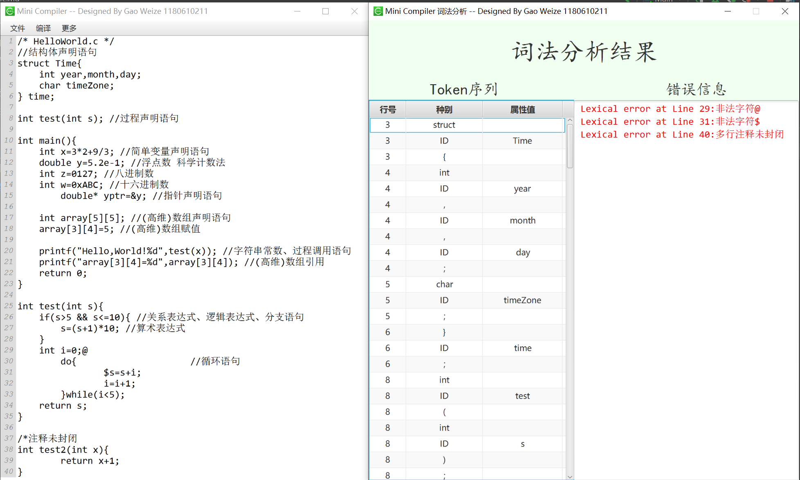

该项目采用Maven进行依赖管理，引用了外部的Jar包，因此请确保采用Maven项目打开。

建议采用IDEA打开，运行Main类中的main方法，即可启动GUI界面，根据菜单栏选择所要进行的操作。


依赖如下：
```xml
<dependencies>
        <!-- https://mvnrepository.com/artifact/org.fxmisc.richtext/richtextfx -->
        <dependency>
            <groupId>org.fxmisc.richtext</groupId>
            <artifactId>richtextfx</artifactId>
            <version>0.10.0</version>
        </dependency>
</dependencies>
```

# Compiler
