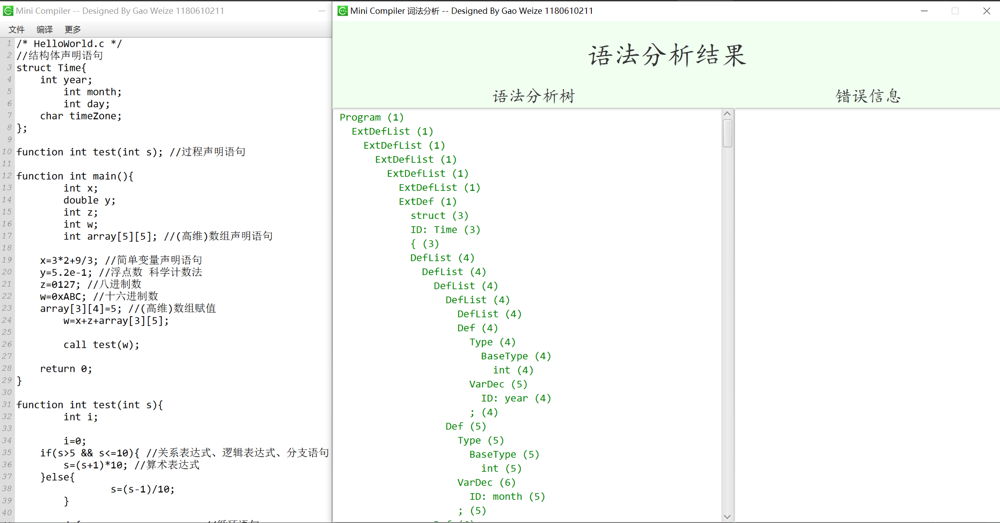
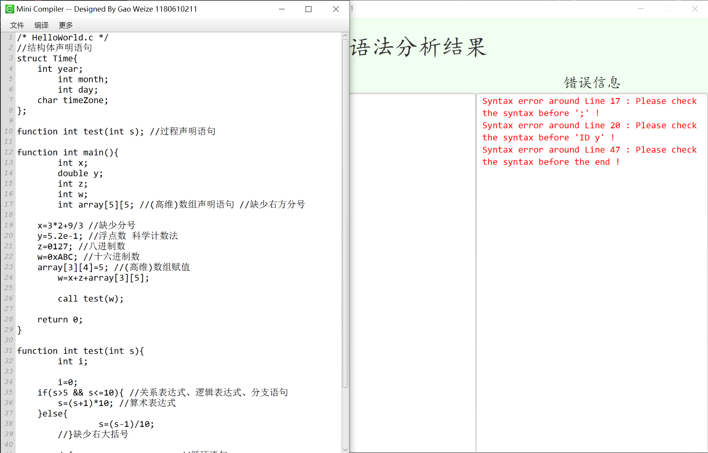

该项目采用Maven进行依赖管理，引用了外部的Jar包，因此请确保采用Maven项目打开。

建议采用IDEA打开，运行Main类中的main方法，即可启动GUI界面，根据菜单栏选择所要进行的操作。


依赖如下：
```xml
<dependencies>
        <!-- https://mvnrepository.com/artifact/org.fxmisc.richtext/richtextfx -->
        <dependency>
            <groupId>org.fxmisc.richtext</groupId>
            <artifactId>richtextfx</artifactId>
            <version>0.10.0</version>
        </dependency>
</dependencies>
```

## 词法分析


## 语法分析
文法保存在src/main/resources/grammar.txt，具体内容如下：
``` 
S ::= Program
Program ::= ExtDefList
ExtDefList ::= ExtDefList ExtDef | ε
ExtDef ::= Type VarDec ; | struct ID { DefList } ; | function Type FunDec CompSt | function Type FunDec ; 

BaseType ::= bool | char | int | float | double
Type ::= BaseType | struct ID

DefList ::= DefList Def | ε
Def ::= Type VarDec ; | struct ID { DefList } ;

VarDec ::= ID | VarDec [ INTNUM ]
FunDec ::= ID ( VarList ) | ID ( )
VarList ::= VarList , ParamDec | ParamDec
ParamDec ::= Type VarDec

CompSt ::= { DefList StmtList }
StmtList ::= StmtList Stmt | ε

Stmt ::= Exp ; | ID = Exp ; | L = Exp ; | CompSt | if ( B ) Stmt | if ( B ) Stmt else Stmt | return Exp ; | while ( B ) Stmt | do Stmt while ( B ) ; 
L ::= ID [ Exp ] | L [ Exp ]
Exp ::= Exp + Exp | Exp - Exp | Exp * Exp | Exp / Exp | ( Exp ) | ID | L | INTNUM | REALNUM | STRING | call ID ( ) | call ID ( ParamList )
ParamList ::= ParamList , Exp | Exp
B ::= B || B | B && B | ! B | ( B ) | Exp relop Exp | true | false
relop ::= < | <= | == | != | > | >=
```




语法分析如果没有错误则打印对应的语法分析树，存在错误则采用恐慌模式进行恢复，并输出相应的错误信息。